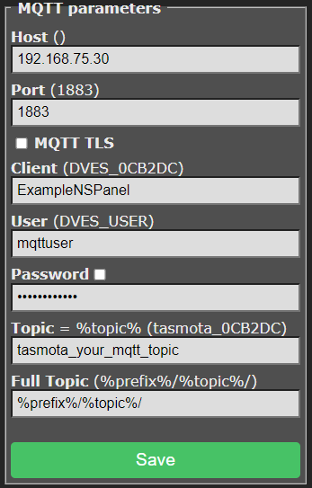

# Configure MQTT on Tasmota

Configure your MQTT Server in Tasmota.
See Tasmota [MQTT Documentation](https://tasmota.github.io/docs/MQTT/) for more details.



Please leave the Full Topic as it is in default configuration (and on the screenshot).

Change the topic to something unique for your panel, you will need this topic later in the configuration of your panel in appdaemon / apps.yaml

# Note for Appdeamon Addon Version >= 15

The configuration has been moved out of the config folder from homeassistant. This is how you can access it with the VSCode Addon.


# Configure MQTT Connection on AppDaemon

For the app to work you need a working MQTT Configuration in AppDaemon. Please add the configuration of your mqtt server, user and password to your existing `appdaemon.yaml` Restart your AppDaemon Container (not HomeAssistant) after adding the MQTT Configuration.

You will find this file in the following location: `/addon_configs/a0d7b954_appdaemon/appdeamon.yaml`

```yaml
---
secrets: /config/secrets.yaml
appdaemon:
  latitude: 52.0
  longitude: 4.0
  elevation: 2
  time_zone: Europe/Berlin
  app_dir: /homeassistant/appdaemon/apps/ # !!! This is really important for AppDaemon HA Addon >= 15
  plugins:
    HASS:
      type: hass
    MQTT:
      type: mqtt
      namespace: mqtt
      client_id: "appdaemon"
      client_host: core-mosquitto.local.hass.io # This should work if you are using supervised HomeAssistant; if not use the IP Address instead.
      #client_host: 192.168.75.30
      client_port: 1883
      client_user: "mqttuser"
      client_password: "mqttpassword"
      client_topics: NONE
http:
  url: http://127.0.0.1:5050
admin:
api:
hadashboard:
```

# Configure NsPanel on AppDaemon

Please add the following minimal configuration to your apps.yaml, which is located in `config/appdaemon/apps/apps.yaml`

```yaml
---
nspanel-1:
  module: nspanel-lovelace-ui
  class: NsPanelLovelaceUIManager
  config:
    panelRecvTopic: "tele/tasmota_your_mqtt_topic/RESULT"
    panelSendTopic: "cmnd/tasmota_your_mqtt_topic/CustomSend"
    model: eu
```

Please adjust `tasmota_your_mqtt_topic` to the topic used in Tasmota MQTT Configuration.

If your configuration is correct you should get the following screens on your panel:


<details>
<summary>Note: You can add multiple panels to this configuration:</summary>
<br>
```yaml
---
nspanel-1:
  module: nspanel-lovelace-ui
  class: NsPanelLovelaceUIManager
  config:
    panelRecvTopic: "tele/first-nspanel-topic/RESULT"
    panelSendTopic: "cmnd/first-nspanel-topic/CustomSend"
nspanel-2:
  module: nspanel-lovelace-ui
  class: NsPanelLovelaceUIManager
  config:
    panelRecvTopic: "tele/second-nspanel-topic/RESULT"
    panelSendTopic: "cmnd/second-nspanel-topic/CustomSend"
```
</details>
